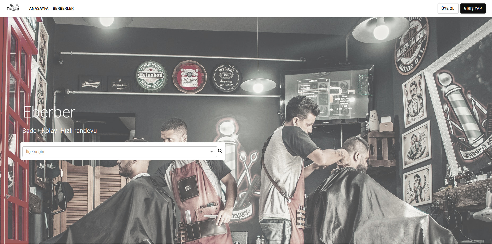
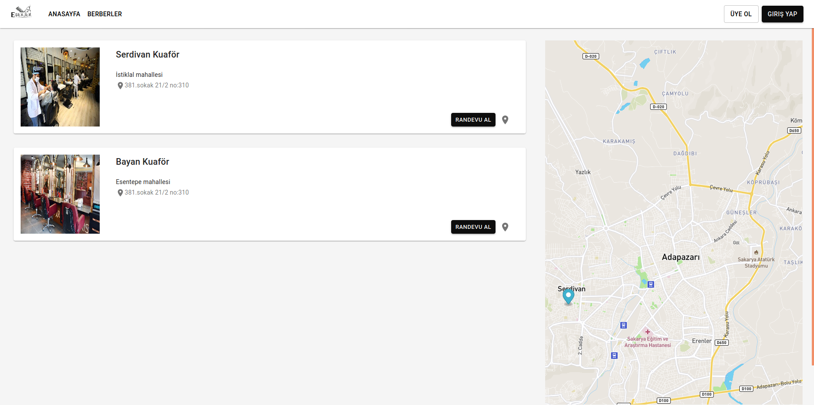
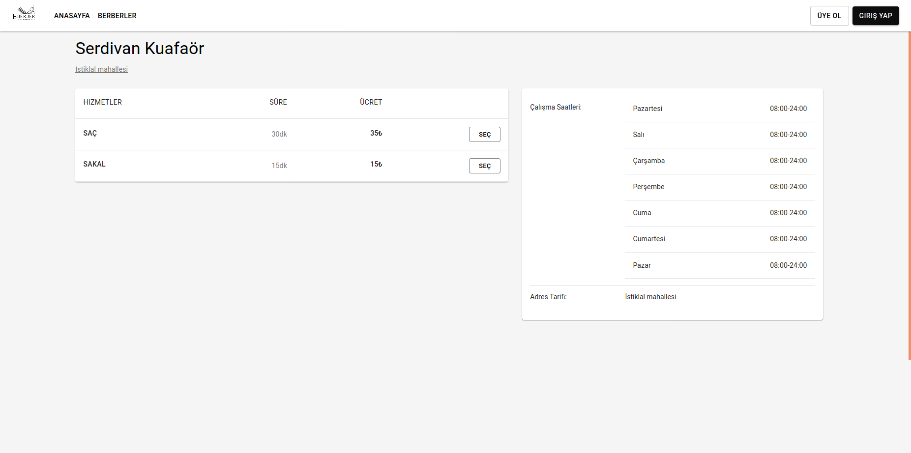
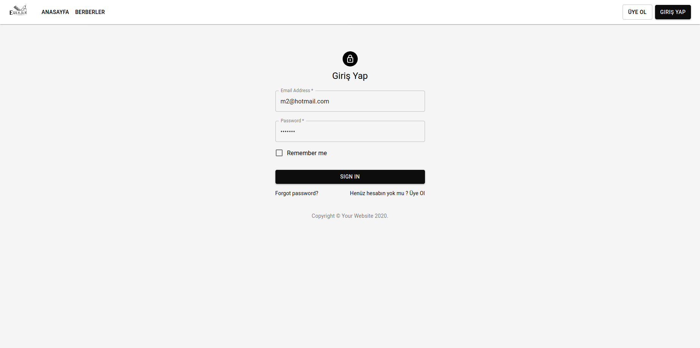
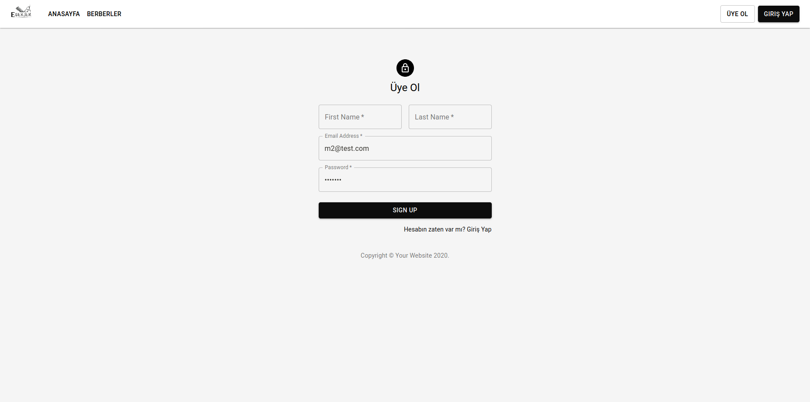
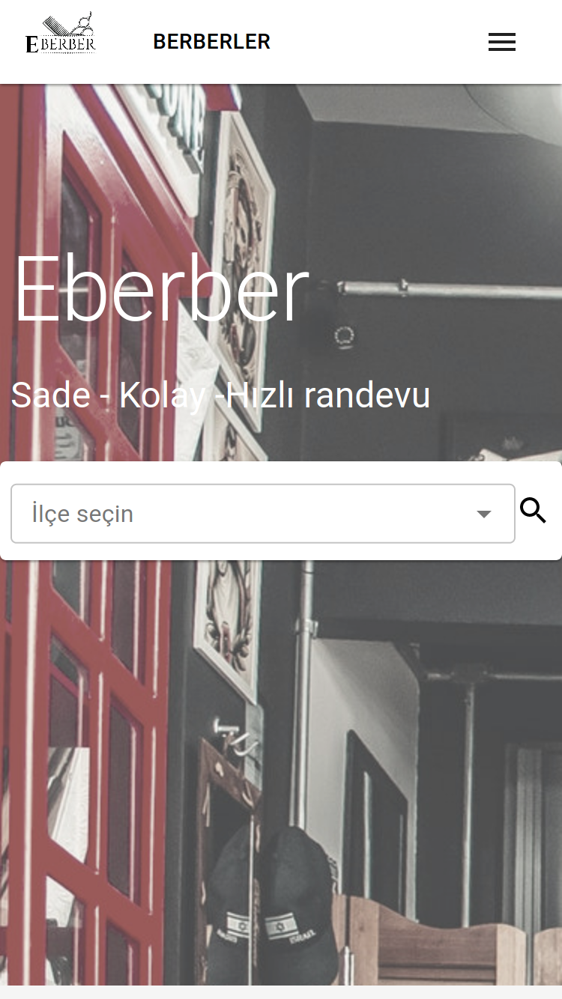
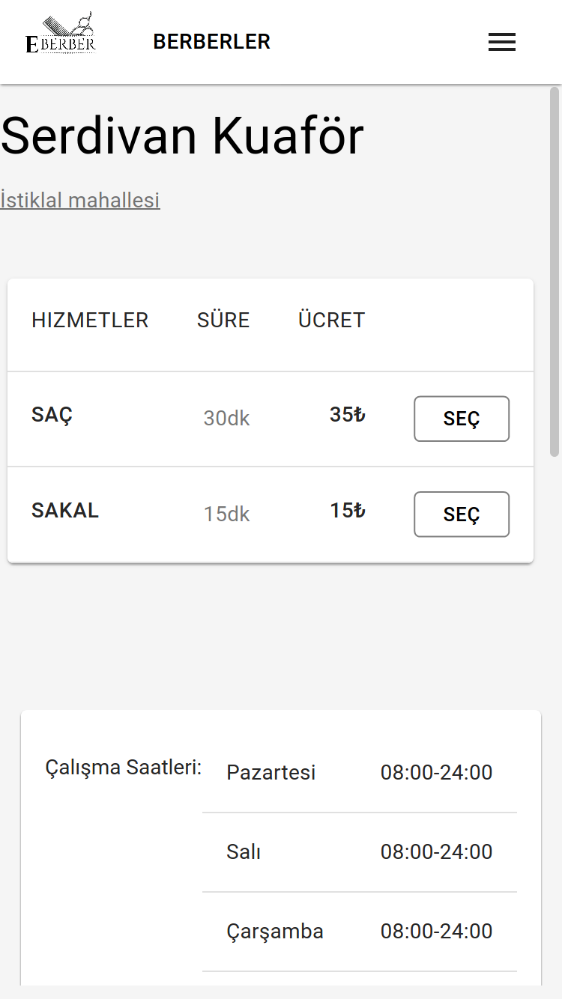

## Eberber :scissors: :convenience_store: 

_Made with MaterialUi_

## Screenshots

<div align="left" style="margin-bottom:1em">
    
    
    
    
    
    
    
</div>

## Installation :arrow_down:

- git clone
- npm start

### Clone

- Clone this repo to your local machine using `https://github.com/metinozkan/E-berber.git`

```shell
$ git clone https://github.com/metinozkan/E-berber.git
```

### Setup

```shell
$ npm install
```

### Start

```shell
$ npm start
```

